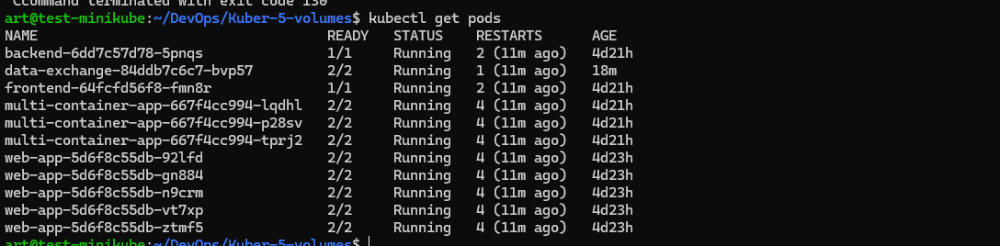
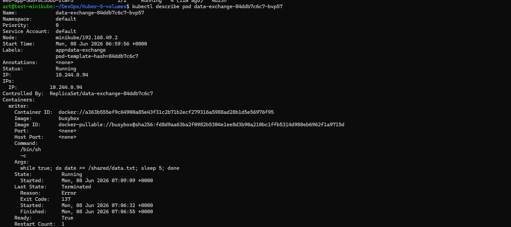
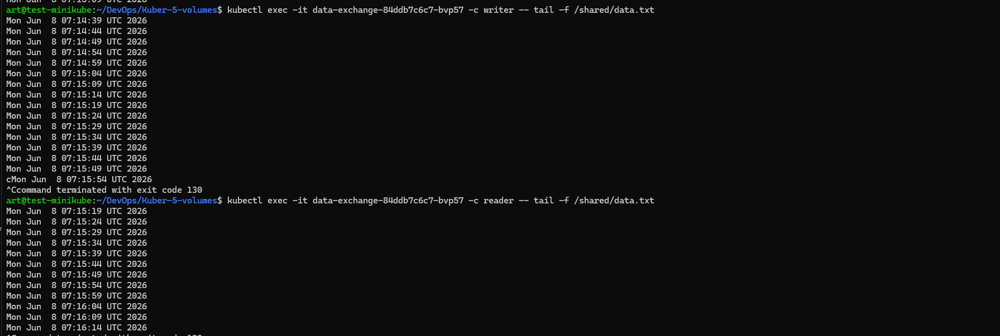
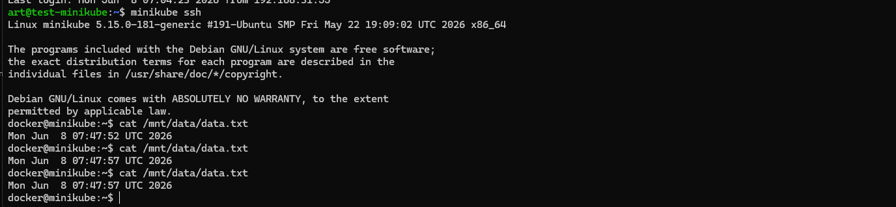
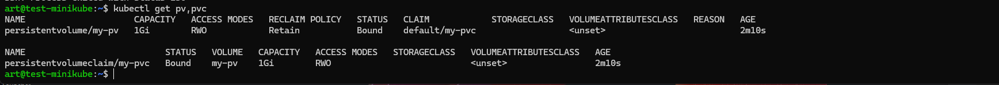
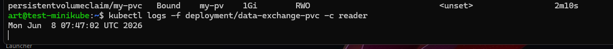
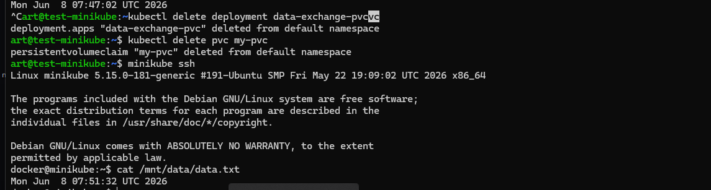
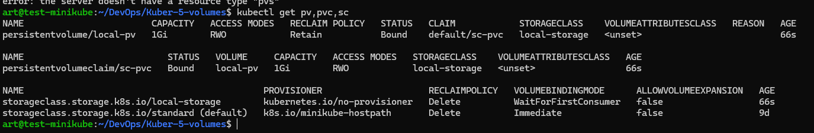
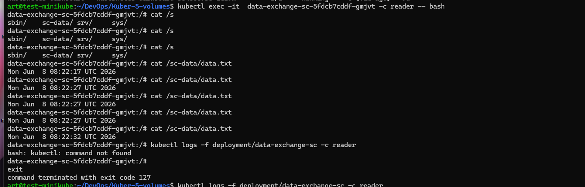

## задание 
https://github.com/netology-code/kuber-homeworks/blob/shkuber-16/2.1/2.1.md

включим
```
minikube addons enable storage-provisioner
```

# Задание 1. Volume: обмен данными между контейнерами в поде  ``emptyDir``

Манифест ``containers-data-exchange.yaml``

```
apiVersion: apps/v1
kind: Deployment
metadata:
  name: data-exchange
spec:
  replicas: 1
  selector:
    matchLabels:
      app: data-exchange
  template:
    metadata:
      labels:
        app: data-exchange
    spec:
      containers:
      - name: writer
        image: busybox
        command: ["/bin/sh", "-c"]
        args: ["while true; do date > /shared/data.txt; sleep 5; done"]
        volumeMounts:
        - name: shared-volume
          mountPath: /shared
      - name: reader
        image: wbitt/network-multitool   # multitool образ
        command: ["/bin/sh", "-c"]
        args: ["tail -f /shared/data.txt"]
        volumeMounts:
        - name: shared-volume
          mountPath: /shared
      volumes:
      - name: shared-volume
        emptyDir: {}

```

``emptyDir: {}`` – временное хранилище, живущее пока существует под.

``writer (busybox)`` каждые 5 секунд перезаписывает файл ``/shared/data.txt`` текущей датой.

``reader (multitool)`` читает файл командой ``tail -f``, пока не остановится.``tail -f``, показывая изменения в реальном времени.

Общая директория ``/shared`` монтируется в оба контейнера.

```
kubectl apply -f containers-data-exchange.yaml
```
```
kubectl get pods
```


```
data-exchange-84ddb7c6c7-bvp57    
```


```
kubectl logs -f data-exchange-84ddb7c6c7-bvp57 -c reader   # вывод файла
```




# Задание 2. PV, PVC
Манифест ``pv-pvc.yaml``


```
---
apiVersion: v1
kind: PersistentVolume
metadata:
  name: my-pv
spec:
  capacity:
    storage: 1Gi
  volumeMode: Filesystem
  accessModes:
    - ReadWriteOnce
  persistentVolumeReclaimPolicy: Retain
  hostPath:
    path: /mnt/data    # директория на ноде (должна существовать)
---
apiVersion: v1
kind: PersistentVolumeClaim
metadata:
  name: my-pvc
spec:
  volumeName: my-pv
  volumeMode: Filesystem
  accessModes:
    - ReadWriteOnce
  resources:
    requests:
      storage: 1Gi
---
apiVersion: apps/v1
kind: Deployment
metadata:
  name: data-exchange-pvc
spec:
  replicas: 1
  selector:
    matchLabels:
      app: data-exchange-pvc
  template:
    metadata:
      labels:
        app: data-exchange-pvc
    spec:
      containers:
      - name: writer
        image: busybox
        command: ["/bin/sh", "-c"]
        args: ["while true; do date > /mnt/data.txt; sleep 5; done"]
        volumeMounts:
        - name: persistent-storage
          mountPath: /mnt
      - name: reader
        image: wbitt/network-multitool
        command: ["/bin/sh", "-c"]
        args: ["tail -f /mnt/data.txt"]
        volumeMounts:
        - name: persistent-storage
          mountPath: /mnt
      volumes:
      - name: persistent-storage
        persistentVolumeClaim:
          claimName: my-pvc
```


PV использует ``hostPath``, чтобы привязать PV к существующей директории. ``hostPath`` – реальная папка на узле ``/mnt/data``.

PV привязывается к PVC по имени (volumeName). После создания Deployment под монтирует этот PV.
``persistentVolumeReclaimPolicy: Retain`` – при удалении PVC PV не удаляется, а переходит в состояние Released.



PVC привязывается к PV по имени (volumeName). После создания Deployment под монтирует этот PVC.


Создать ресурсы
```
kubectl apply -f pv-pvc.yaml
```
Проверить чтение
```
kubectl logs -f deployment/data-exchange-pvc -c reader – увидите обновляемую 
дату.
```


Удалить Deployment и PVC

```
kubectl delete deployment data-exchange-pvc
kubectl delete pvc my-pvc
```
Что с PV?
``hostPath`` – это просто привязка к существующей директории. Удаление PV не затрагивает файловую систему хоста.
```
kubectl describe pv my-pv – статус Released.

```
Почему? Политика Retain не удаляет PV, но он больше не привязан к PVC. Данные на диске узла сохраняются.

Проверить файл на узле
На ноде (например, через ssh или minikube ssh):
cat /mnt/data/data.txt – содержимое есть.

Удалить PV
```
kubectl delete pv my-pv
```
Что 
Почему? hostPath – это просто привязка к существующей директории. Удаление PV не затрагивает файловую систему хоста.


# Задание 3. StorageClass

Манифест ``sc.yaml``
```
---
apiVersion: storage.k8s.io/v1
kind: StorageClass
metadata:
  name: local-storage
provisioner: kubernetes.io/no-provisioner
volumeBindingMode: WaitForFirstConsumer
---
apiVersion: v1
kind: PersistentVolume
metadata:
  name: local-pv
spec:
  capacity:
    storage: 1Gi
  volumeMode: Filesystem
  accessModes:
    - ReadWriteOnce
  storageClassName: local-storage   # связь со StorageClass
  hostPath:
    path: /mnt/sc-data
---
apiVersion: v1
kind: PersistentVolumeClaim
metadata:
  name: sc-pvc
spec:
  volumeMode: Filesystem
  accessModes:
    - ReadWriteOnce
  resources:
    requests:
      storage: 1Gi
  storageClassName: local-storage
---
apiVersion: apps/v1
kind: Deployment
metadata:
  name: data-exchange-sc
spec:
  replicas: 1
  selector:
    matchLabels:
      app: data-exchange-sc
  template:
    metadata:
      labels:
        app: data-exchange-sc
    spec:
      containers:
      - name: writer
        image: busybox
        command: ["/bin/sh", "-c"]
        args: ["while true; do date > /sc-data/data.txt; sleep 5; done"]
        volumeMounts:
        - name: sc-storage
          mountPath: /sc-data
      - name: reader
        image: wbitt/network-multitool
        command: ["/bin/sh", "-c"]
        args: ["tail -f /sc-data/data.txt"]
        volumeMounts:
        - name: sc-storage
          mountPath: /sc-data
      volumes:
      - name: sc-storage
        persistentVolumeClaim:
          claimName: sc-pvc
```

#### Пояснения:

StorageClass с provisioner: ``` kubernetes.io/no-provisioner ``` не создаёт PV автоматически. Поэтому мы вручную создаём PV с тем же storageClassName и hostPath на ноде.

PVC ссылается на этот StorageClass. Благодаря volumeBindingMode: WaitForFirstConsumer привязка PVC к PV произойдёт только после создания пода.


```
kubectl apply -f sc.yaml
kubectl get pv,pvc,sc
kubectl logs -f deployment/data-exchange-sc -c reader   # данные обновляются
```



# DevOps_Netology_Homework_11-Kuber-5-volumes-storages
